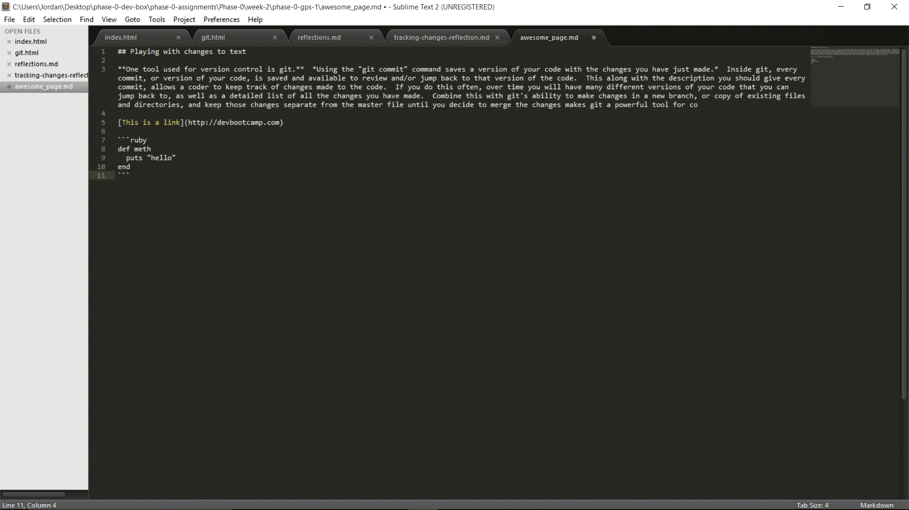

## Playing with changes to text

**One tool used for version control is git.**  *Using the "git commit" command saves a version of your code with the changes you have just made.*  Inside git, every commit, or version of your code, is saved and available to review and/or jump back to that version of the code.  This along with the description you should give every commit, allows a coder to keep track of changes made to the code.  If you do this often, over time you will have many different versions of your code that you can jump back to, as well as a detailed list of all the changes you have made.  Combine this with git's ability to make changes in a new branch, or copy of existing files and directories, and keep those changes separate from the master file until you decide to merge the changes makes git a powerful tool for co

[This is a link](http://devbootcamp.com)

```ruby
def meth
  puts "hello"
end
```

